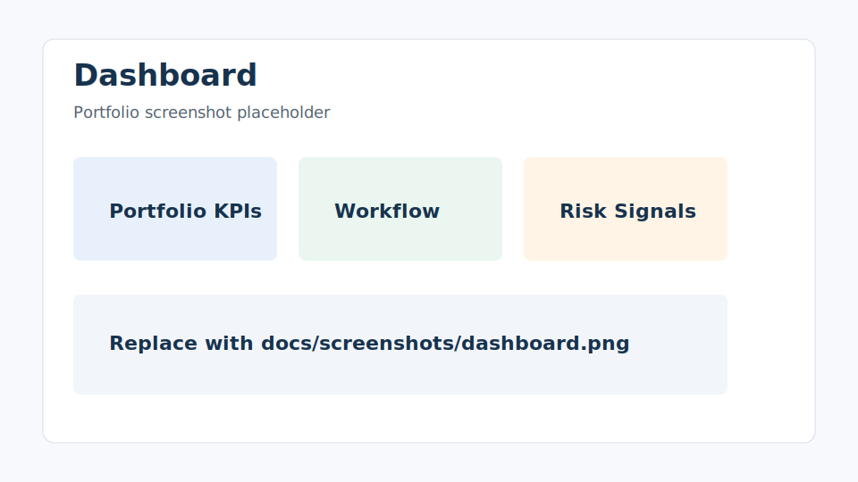
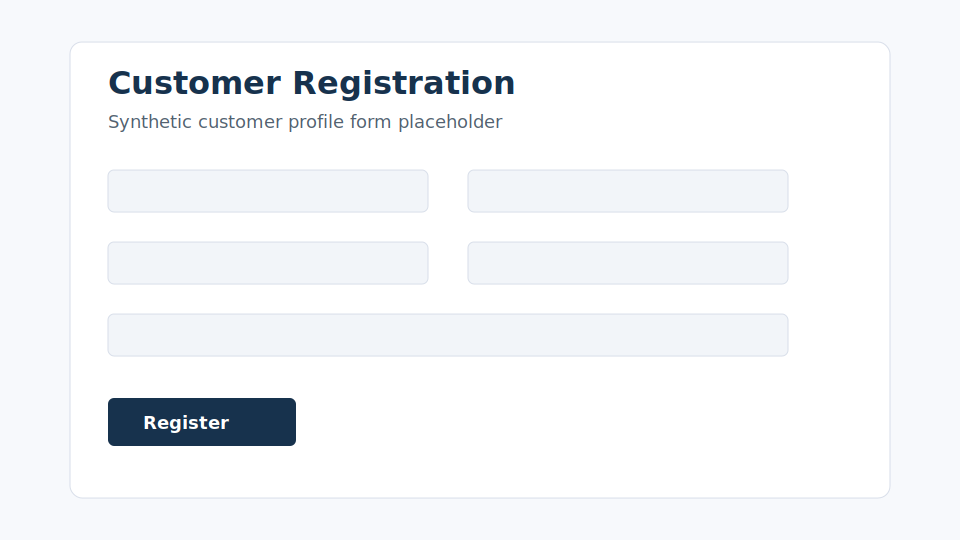
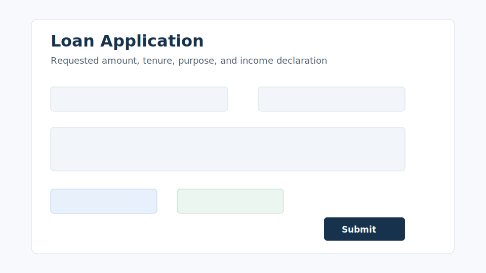
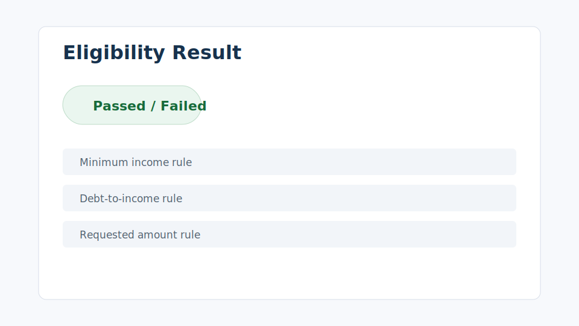
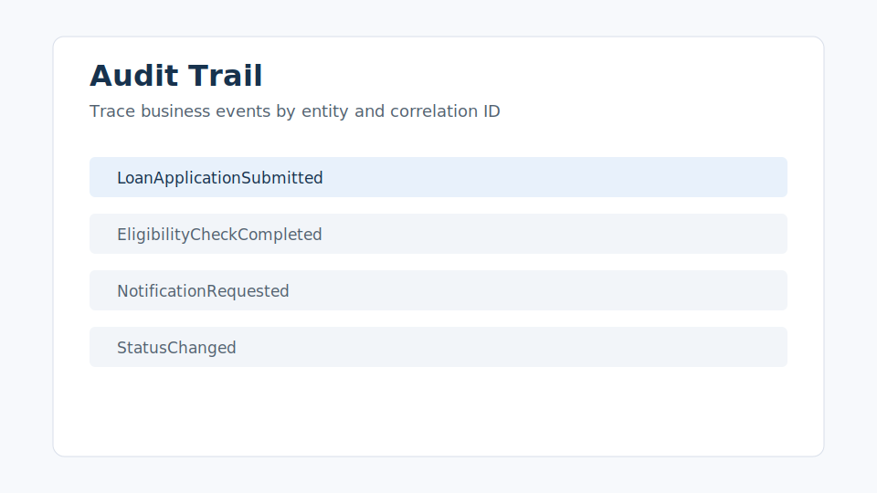

# Enterprise Loan Origination Platform

[](https://github.com/koushikchandramaji/enterprise-loan-origination-platform/actions/workflows/ci.yml)


Enterprise Loan Origination Platform is a portfolio-grade banking application that demonstrates how a modern loan journey can be designed, implemented, tested, containerized, documented, and prepared for Azure deployment.

It models a realistic but intentionally simplified origination workflow: customer registration, loan application submission, rule-based eligibility evaluation, application status tracking, notification simulation, and centralized audit logging. It is not a real credit approval engine. It is an architecture showcase for .NET, Angular, Azure-ready microservices, API governance, observability, security, DevOps, and enterprise documentation.

## Why This Repository Stands Out

| Area | What reviewers can inspect |
| --- | --- |
| Solution architecture | HLD, LLD, ADRs, system/container diagrams, event model, NFRs |
| Backend engineering | ASP.NET Core APIs, EF Core persistence, validation, domain rules, thin controllers |
| Frontend engineering | Angular standalone components, typed services, route-based features, reactive forms |
| Cloud readiness | Azure Container Apps, Azure SQL, Service Bus, Key Vault, ACR, App Insights Bicep blueprint |
| Production support | Correlation IDs, health checks, structured logging, Problem Details, operational runbook |
| Delivery maturity | Docker Compose, GitHub Actions CI, backend/frontend tests, deployment docs |

## Implementation Status

| Capability | Status | Honest scope |
| --- | --- | --- |
| Customer registration | Implemented | Synthetic customer data, validation, EF Core persistence, Angular form |
| Loan application submission | Implemented | Application lifecycle, validation, controlled status model, audit event creation |
| Eligibility evaluation | Implemented | Demo rule engine for income, tenure, DTI, obligations, and amount limits |
| Application status tracking | Implemented | Controlled transitions and status history |
| Notification simulation | Implemented | Local HTTP event simulation with email/SMS-style notification requests |
| Audit logging | Implemented | Central audit records with correlation ID and entity traceability |
| Angular portal | Implemented | Dashboard-oriented feature structure and typed API services |
| Observability foundation | Implemented | Correlation middleware, health endpoints, structured logging pattern, runbook |
| Docker and CI | Implemented | Service Dockerfiles, Docker Compose, GitHub Actions build/test workflow |
| Azure deployment | Blueprint only | Bicep templates and deployment guide; not auto-deployed from this repo |
| Authentication/authorization | Roadmap | Azure Entra ID / Entra External ID direction documented, not implemented in MVP |

## What This Project Demonstrates

- Architecture-first delivery with HLD, LLD, ADRs, data model, event model, NFRs, and deployment documentation.
- Banking-domain modeling using Customer, Loan Application, Eligibility Check, Application Status, Notification, and Audit Event concepts.
- Clean service boundaries for customer, loan application, eligibility, notification, and audit capabilities.
- API-first design with `/api/v1` routes, DTO contracts, validation, Problem Details, Swagger/OpenAPI, and correlation ID propagation.
- Testable .NET application and domain logic with focused unit/service tests.
- Angular frontend structure suitable for an enterprise portal: feature folders, typed API services, interceptors, reactive forms, loading/error states.
- Event-driven direction using integration event contracts and an MVP HTTP simulation path that can evolve to Azure Service Bus.
- Azure-ready deployment thinking with Container Apps, Azure SQL, Service Bus, Key Vault, Container Registry, Application Insights, Log Analytics, and Static Web Apps.
- Operational maturity through health checks, structured logging, support runbook, secure configuration notes, and CI validation.

## Architecture At A Glance

```text
Angular Loan Portal
        |
        v
Customer.Api      LoanApplication.Api      Eligibility.Api
        |                 |                       |
        |                 v                       v
        |        Notification.Worker <---- integration event simulation
        |                 |
        +-----------------+---------------------> Audit.Api
                                                  |
                                                  v
                                  SQL Server locally / Azure SQL target
```

The MVP runs locally with Docker Compose and SQL Server. The production direction is documented as Azure Container Apps for APIs/workers, Azure Static Web Apps for the Angular portal, Azure SQL for persistence, Azure Service Bus for asynchronous messaging, and Application Insights/Log Analytics for telemetry.

## Architecture Documentation

| Document | Purpose |
| --- | --- |
| [Architecture overview](architecture/README.md) | Map of all architecture artifacts |
| [High-level design](architecture/hld.md) | Business context, system context, containers, responsibilities |
| [Low-level design](architecture/lld.md) | Service internals, API flow, validation, persistence, event handling |
| [API governance](architecture/api-governance.md) | REST conventions, Problem Details, correlation, versioning |
| [Security architecture](architecture/security-architecture.md) | Secure defaults, secret handling, future authentication direction |
| [Observability architecture](architecture/observability-architecture.md) | Logging, correlation, health checks, tracing readiness |
| [Deployment architecture](architecture/deployment-architecture.md) | Local Docker topology and Azure target model |
| [Data model](architecture/data-model.md) | Service-owned relational model |
| [Event model](architecture/event-model.md) | Integration event conventions and MVP simulation |
| [Architecture decision records](architecture/adr/) | Key decisions and tradeoffs |

## Diagrams

- [System context](architecture/diagrams/system-context.md)
- [Container diagram](architecture/diagrams/container-diagram.md)
- [Loan application submission sequence](architecture/diagrams/loan-application-sequence.md)
- [Eligibility evaluation sequence](architecture/diagrams/eligibility-evaluation-sequence.md)
- [Notification and audit event flow](architecture/diagrams/notification-audit-event-flow.md)
- [Azure deployment blueprint](architecture/diagrams/azure-deployment.md)
- [CI/CD pipeline](architecture/diagrams/cicd-pipeline.md)

## Technology Stack

| Layer | Technology |
| --- | --- |
| Backend | .NET 8, ASP.NET Core Web API, C# 12 |
| Data | Entity Framework Core, SQL Server locally, Azure SQL target |
| Validation | FluentValidation-style request validators |
| Frontend | Angular 18, standalone components, strict TypeScript, reactive forms |
| Integration | HTTP simulation for MVP, Azure Service Bus target |
| Observability | Correlation IDs, health checks, Problem Details, structured logging pattern |
| DevOps | Docker, Docker Compose, GitHub Actions |
| Azure blueprint | Container Apps, Static Web Apps, Azure SQL, Service Bus, Key Vault, ACR, Application Insights, Log Analytics |

## Screenshots

Real browser screenshots are not committed yet. The placeholders below document the intended portfolio captures and can be replaced with PNG screenshots after running the app locally.

| Dashboard | Customer Registration |
| --- | --- |
|  |  |

| Loan Application | Eligibility Result | Audit Trail |
| --- | --- | --- |
|  |  |  |

Capture guidance is available in [screenshot capture notes](docs/screenshots/README.md).

## Repository Structure

```text
src/
  services/
    Customer.Api/
    LoanApplication.Api/
    Eligibility.Api/
    Notification.Worker/
    Audit.Api/
  building-blocks/
    Auditing/
    Messaging/
    Observability/
    Security/
    SharedKernel/
  web/
    loan-portal-angular/
tests/
architecture/
docs/
infra/bicep/
.github/workflows/
```

## API Overview

Swagger/OpenAPI is enabled for the APIs in development. Key contracts are summarized in [API contracts](docs/api-contracts.md).

| Service | Local Docker Port | Swagger |
| --- | --- | --- |
| Customer API | `7101` | `http://localhost:7101/swagger` |
| Loan Application API | `7102` | `http://localhost:7102/swagger` |
| Eligibility API | `7103` | `http://localhost:7103/swagger` |
| Notification Worker/API | `5004` | `http://localhost:5004/swagger` |
| Audit API | `5005` | `http://localhost:5005/swagger` |

All APIs use `X-Correlation-ID` propagation. Metadata and audit query endpoints return a standard success envelope:

```json
{
  "data": {},
  "correlationId": "string",
  "timestamp": "2026-01-01T10:00:00Z"
}
```

## Local Development

Prerequisites:

- .NET 8 SDK
- Node.js 22 or another Angular 18-compatible LTS/current Node version
- npm
- Docker Desktop
- Git
- Azure CLI only for Bicep validation

Restore and build:

```powershell
dotnet restore EnterpriseLoanOriginationPlatform.sln
dotnet build EnterpriseLoanOriginationPlatform.sln
```

Run the Angular portal:

```powershell
cd src/web/loan-portal-angular
npm install
npm start
```

Open `http://localhost:4200`.

Run one API directly:

```powershell
dotnet run --project src/services/Customer.Api/Customer.Api.csproj
```

For full setup details, see [developer setup](docs/setup.md) and [local development](docs/local-development.md).

## Docker-Based Development

Build and run the local platform:

```powershell
docker compose --profile services --profile frontend build
docker compose --profile services --profile frontend up -d
```

Stop the platform:

```powershell
docker compose --profile services --profile frontend down
```

The compose file contains a local-only SQL Server developer password for demo execution. Do not reuse it outside local development.

## Testing

Backend:

```powershell
dotnet test EnterpriseLoanOriginationPlatform.sln --configuration Release
```

Frontend:

```powershell
cd src/web/loan-portal-angular
npm ci
npm run build
npm run test:ci
```

Docker validation:

```powershell
docker compose --profile services --profile frontend build
```

Bicep validation:

```powershell
az bicep build --file infra/bicep/main.bicep
```

Testing approach is documented in [testing strategy](docs/testing-strategy.md).

## DevOps And Deployment

- [GitHub Actions CI](.github/workflows/ci.yml) restores, builds, and tests backend/frontend code.
- [Docker Compose](docker-compose.yml) provides a local SQL Server plus service/API topology.
- [Container build template](.github/workflows/container-build-template.yml) shows future ACR image publishing.
- [Azure deployment template](.github/workflows/azure-deploy-template.yml) shows OIDC-based infrastructure deployment direction.
- [Bicep templates](infra/bicep/) define the Azure deployment blueprint.

Deployment documentation:

- [Deployment guide](docs/deployment.md)
- [DevOps guide](docs/devops-guide.md)
- [Azure deployment guide](docs/azure-deployment-guide.md)
- [Bicep README](infra/bicep/README.md)

## Observability And Production Readiness

- `X-Correlation-ID` is generated or propagated across frontend and APIs.
- Backend services expose health endpoints for local diagnostics and Azure Container Apps probes.
- Global exception handling returns Problem Details without leaking stack traces.
- Audit events provide business traceability by entity, action, source service, and correlation ID.
- [Operational runbook](docs/operational-runbook.md) describes triage flows and Log Analytics query direction.

## Security And Compliance Readiness

- No real customer data, credentials, or production financial data are included.
- Configuration is environment-based and ready for Key Vault references in Azure.
- Authentication is intentionally deferred for MVP, with Azure Entra ID / Entra External ID and RBAC documented as the target.
- Logs and audit metadata must avoid secrets, passwords, full personal identifiers, and sensitive financial data.
- Security posture is documented in [security architecture](architecture/security-architecture.md).

## Portfolio Value

This repository is designed to show Solution Architect-level thinking, not only feature delivery. It demonstrates how to take a banking use case from business capabilities through service boundaries, API contracts, domain rules, event flow, local execution, tests, observability, security posture, CI/CD, and Azure deployment planning.

It is intentionally scoped as an MVP, but the structure is enterprise-oriented: clear ownership, documented tradeoffs, testable logic, operational diagnostics, cloud deployment direction, and a roadmap that separates implemented functionality from future production hardening.

## Final Roadmap

The MVP portfolio baseline is complete through Epic 10. Recommended next steps:

1. Capture real browser screenshots and replace the placeholders in `docs/screenshots`.
2. Add real authentication with Azure Entra ID or Entra External ID.
3. Replace MVP HTTP event simulation with Azure Service Bus topics/subscriptions.
4. Add EF Core migrations and controlled migration deployment.
5. Add browser-level smoke tests with Playwright.
6. Add OpenTelemetry traces and richer Application Insights dashboards.
7. Add API Management policy examples for JWT validation, rate limiting, and correlation propagation.
8. Add a short demo script and sample request collection.

See the detailed [roadmap](docs/roadmap.md).
