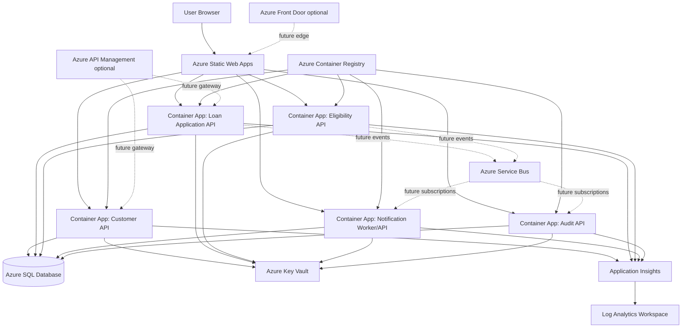

# Azure Deployment Diagram

```mermaid
flowchart TB
  User[User Browser] --> StaticWeb[Azure Static Web Apps]
  StaticWeb --> CustomerApp[Container App: Customer API]
  StaticWeb --> LoanApp[Container App: Loan Application API]
  StaticWeb --> EligibilityApp[Container App: Eligibility API]
  StaticWeb --> NotificationApp[Container App: Notification Worker/API]
  StaticWeb --> AuditApp[Container App: Audit API]

  Acr[Azure Container Registry] --> CustomerApp
  Acr --> LoanApp
  Acr --> EligibilityApp
  Acr --> NotificationApp
  Acr --> AuditApp

  CustomerApp --> Sql[(Azure SQL Database)]
  LoanApp --> Sql
  EligibilityApp --> Sql
  NotificationApp --> Sql
  AuditApp --> Sql

  LoanApp -. future events .-> ServiceBus[Azure Service Bus]
  EligibilityApp -. future events .-> ServiceBus
  ServiceBus -. future subscriptions .-> NotificationApp
  ServiceBus -. future subscriptions .-> AuditApp

  CustomerApp --> KeyVault[Azure Key Vault]
  LoanApp --> KeyVault
  EligibilityApp --> KeyVault
  NotificationApp --> KeyVault
  AuditApp --> KeyVault

  CustomerApp --> AppInsights[Application Insights]
  LoanApp --> AppInsights
  EligibilityApp --> AppInsights
  NotificationApp --> AppInsights
  AuditApp --> AppInsights
  AppInsights --> LogAnalytics[Log Analytics Workspace]

  FrontDoor[Azure Front Door optional] -. future edge .-> StaticWeb
  Apim[Azure API Management optional] -. future gateway .-> CustomerApp
  Apim -. future gateway .-> LoanApp
```
