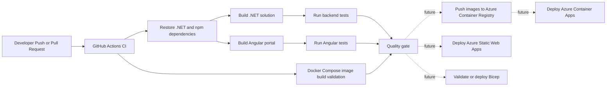

# CI/CD Pipeline Diagram

```mermaid
flowchart LR
  Dev[Developer Push or Pull Request] --> CI[GitHub Actions CI]
  CI --> Restore[Restore .NET and npm dependencies]
  Restore --> BuildBackend[Build .NET solution]
  BuildBackend --> TestBackend[Run backend tests]
  Restore --> BuildFrontend[Build Angular portal]
  BuildFrontend --> TestFrontend[Run Angular tests]
  CI --> DockerBuild[Docker Compose image build validation]

  TestBackend --> QualityGate[Quality gate]
  TestFrontend --> QualityGate
  DockerBuild --> QualityGate

  QualityGate -. future .-> ACR[Push images to Azure Container Registry]
  ACR -. future .-> ACA[Deploy Azure Container Apps]
  QualityGate -. future .-> StaticWeb[Deploy Azure Static Web Apps]
  QualityGate -. future .-> Bicep[Validate or deploy Bicep]
```
