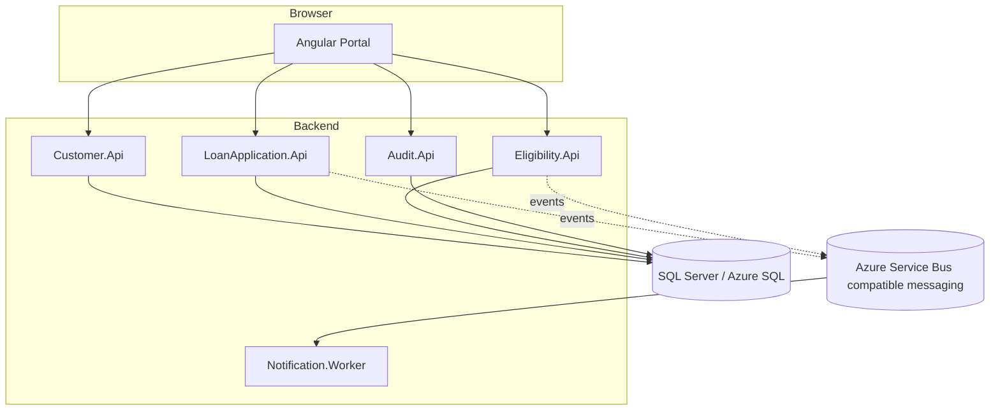

# Container Diagram

```mermaid
flowchart TB
  subgraph Browser
    Portal[Angular Portal]
  end

  subgraph Backend
    CustomerApi[Customer.Api]
    LoanApi[LoanApplication.Api]
    EligibilityApi[Eligibility.Api]
    AuditApi[Audit.Api]
    NotificationWorker[Notification.Worker]
  end

  Sql[(SQL Server / Azure SQL)]
  Bus[(Azure Service Bus compatible messaging)]

  Portal --> CustomerApi
  Portal --> LoanApi
  Portal --> EligibilityApi
  Portal --> AuditApi
  CustomerApi --> Sql
  LoanApi --> Sql
  EligibilityApi --> Sql
  AuditApi --> Sql
  LoanApi -. events .-> Bus
  EligibilityApi -. events .-> Bus
  Bus --> NotificationWorker
```
