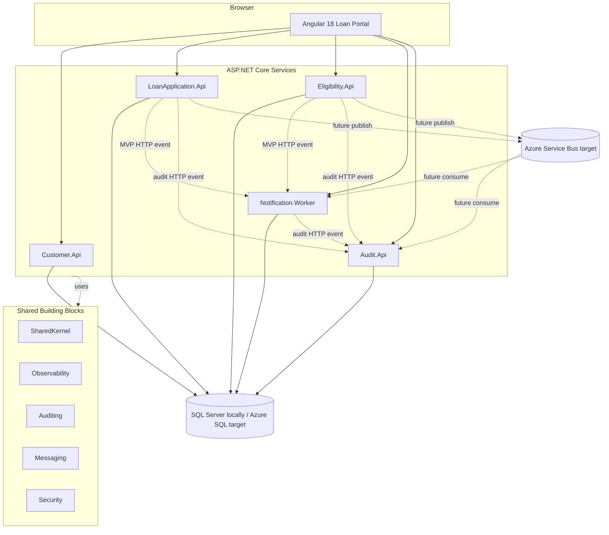

# Container Diagram

```mermaid
flowchart TB
  subgraph Browser
    Portal[Angular 18 Loan Portal]
  end

  subgraph Backend["ASP.NET Core Services"]
    CustomerApi[Customer.Api]
    LoanApi[LoanApplication.Api]
    EligibilityApi[Eligibility.Api]
    NotificationWorker[Notification.Worker]
    AuditApi[Audit.Api]
  end

  subgraph BuildingBlocks["Shared Building Blocks"]
    SharedKernel[SharedKernel]
    Observability[Observability]
    Auditing[Auditing]
    Messaging[Messaging]
    Security[Security]
  end

  Sql[(SQL Server locally / Azure SQL target)]
  Bus[(Azure Service Bus target)]

  Portal --> CustomerApi
  Portal --> LoanApi
  Portal --> EligibilityApi
  Portal --> NotificationWorker
  Portal --> AuditApi

  CustomerApi --> Sql
  LoanApi --> Sql
  EligibilityApi --> Sql
  NotificationWorker --> Sql
  AuditApi --> Sql

  LoanApi -. MVP HTTP event .-> NotificationWorker
  EligibilityApi -. MVP HTTP event .-> NotificationWorker
  LoanApi -. audit HTTP event .-> AuditApi
  EligibilityApi -. audit HTTP event .-> AuditApi
  NotificationWorker -. audit HTTP event .-> AuditApi

  LoanApi -. future publish .-> Bus
  EligibilityApi -. future publish .-> Bus
  Bus -. future consume .-> NotificationWorker
  Bus -. future consume .-> AuditApi

  Backend -. uses .-> BuildingBlocks
```
