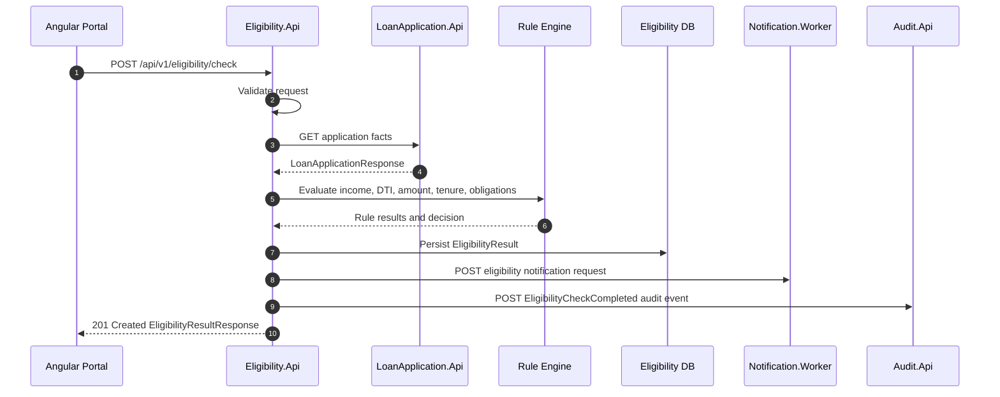

# Eligibility Evaluation Sequence

```mermaid
sequenceDiagram
  autonumber
  participant Portal as Angular Portal
  participant Eligibility as Eligibility.Api
  participant Loan as LoanApplication.Api
  participant Rules as Rule Engine
  participant Db as Eligibility DB
  participant Notify as Notification.Worker
  participant Audit as Audit.Api

  Portal->>Eligibility: POST /api/v1/eligibility/check
  Eligibility->>Eligibility: Validate request
  Eligibility->>Loan: GET application facts
  Loan-->>Eligibility: LoanApplicationResponse
  Eligibility->>Rules: Evaluate income, DTI, amount, tenure, obligations
  Rules-->>Eligibility: Rule results and decision
  Eligibility->>Db: Persist EligibilityResult
  Eligibility->>Notify: POST eligibility notification request
  Eligibility->>Audit: POST EligibilityCheckCompleted audit event
  Eligibility-->>Portal: 201 Created EligibilityResultResponse
```
