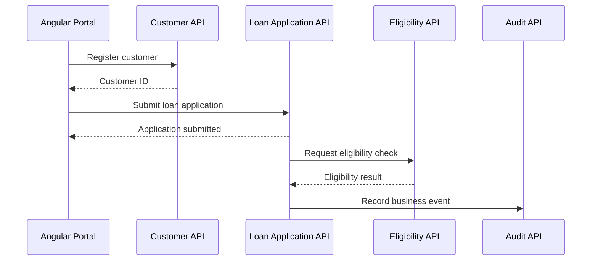

# Loan Application Sequence

```mermaid
sequenceDiagram
  participant Portal as Angular Portal
  participant Customer as Customer API
  participant Loan as Loan Application API
  participant Eligibility as Eligibility API
  participant Audit as Audit API

  Portal->>Customer: Register customer
  Customer-->>Portal: Customer ID
  Portal->>Loan: Submit loan application
  Loan-->>Portal: Application submitted
  Loan->>Eligibility: Request eligibility check
  Eligibility-->>Loan: Eligibility result
  Loan->>Audit: Record business event
```
