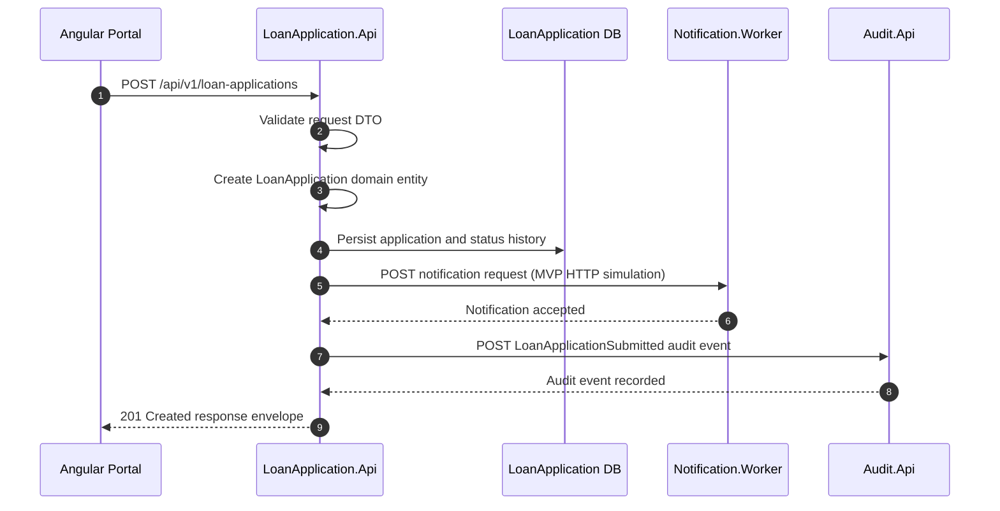

# Loan Application Submission Sequence

```mermaid
sequenceDiagram
  autonumber
  participant Portal as Angular Portal
  participant Loan as LoanApplication.Api
  participant Db as LoanApplication DB
  participant Notify as Notification.Worker
  participant Audit as Audit.Api

  Portal->>Loan: POST /api/v1/loan-applications
  Loan->>Loan: Validate request DTO
  Loan->>Loan: Create LoanApplication domain entity
  Loan->>Db: Persist application and status history
  Loan->>Notify: POST notification request (MVP HTTP simulation)
  Notify-->>Loan: Notification accepted
  Loan->>Audit: POST LoanApplicationSubmitted audit event
  Audit-->>Loan: Audit event recorded
  Loan-->>Portal: 201 Created response envelope
```
