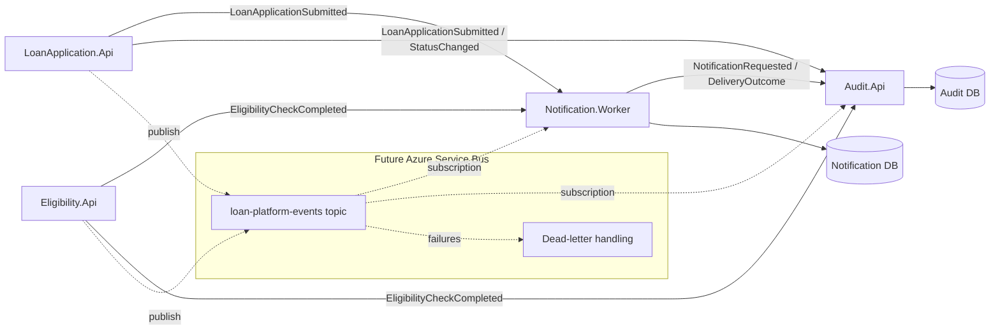

# Notification and Audit Event Flow

```mermaid
flowchart LR
  Loan[LoanApplication.Api] -->|LoanApplicationSubmitted| Notify[Notification.Worker]
  Loan -->|LoanApplicationSubmitted / StatusChanged| Audit[Audit.Api]
  Eligibility[Eligibility.Api] -->|EligibilityCheckCompleted| Notify
  Eligibility -->|EligibilityCheckCompleted| Audit
  Notify -->|NotificationRequested / DeliveryOutcome| Audit

  Notify --> NotificationDb[(Notification DB)]
  Audit --> AuditDb[(Audit DB)]

  subgraph Future["Future Azure Service Bus"]
    Topic[loan-platform-events topic]
    DLQ[Dead-letter handling]
  end

  Loan -. publish .-> Topic
  Eligibility -. publish .-> Topic
  Topic -. subscription .-> Notify
  Topic -. subscription .-> Audit
  Topic -. failures .-> DLQ
```
