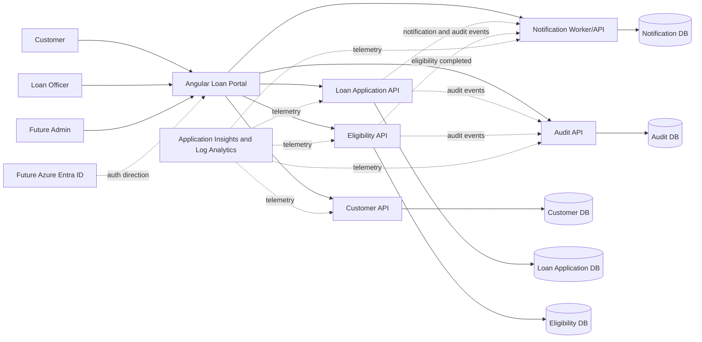

# System Context Diagram

```mermaid
flowchart LR
  Customer[Customer] --> Portal[Angular Loan Portal]
  LoanOfficer[Loan Officer] --> Portal
  Admin[Future Admin] --> Portal

  Portal --> CustomerApi[Customer API]
  Portal --> LoanApi[Loan Application API]
  Portal --> EligibilityApi[Eligibility API]
  Portal --> NotificationApi[Notification Worker/API]
  Portal --> AuditApi[Audit API]

  CustomerApi --> CustomerDb[(Customer DB)]
  LoanApi --> LoanDb[(Loan Application DB)]
  EligibilityApi --> EligibilityDb[(Eligibility DB)]
  NotificationApi --> NotificationDb[(Notification DB)]
  AuditApi --> AuditDb[(Audit DB)]

  LoanApi -. notification and audit events .-> NotificationApi
  LoanApi -. audit events .-> AuditApi
  EligibilityApi -. eligibility completed .-> NotificationApi
  EligibilityApi -. audit events .-> AuditApi

  Entra[Future Azure Entra ID] -. auth direction .-> Portal
  Monitor[Application Insights and Log Analytics] -. telemetry .-> CustomerApi
  Monitor -. telemetry .-> LoanApi
  Monitor -. telemetry .-> EligibilityApi
  Monitor -. telemetry .-> NotificationApi
  Monitor -. telemetry .-> AuditApi
```
