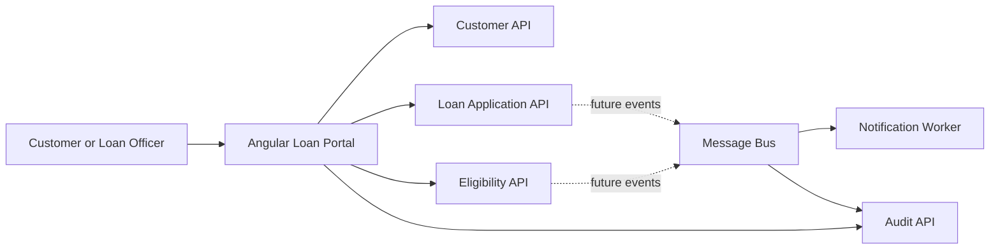

# System Context Diagram

```mermaid
flowchart LR
  Customer[Customer or Loan Officer] --> Portal[Angular Loan Portal]
  Portal --> CustomerApi[Customer API]
  Portal --> LoanApi[Loan Application API]
  Portal --> EligibilityApi[Eligibility API]
  Portal --> AuditApi[Audit API]
  LoanApi -. future events .-> Bus[Message Bus]
  EligibilityApi -. future events .-> Bus
  Bus --> NotificationWorker[Notification Worker]
  Bus --> AuditApi
```
